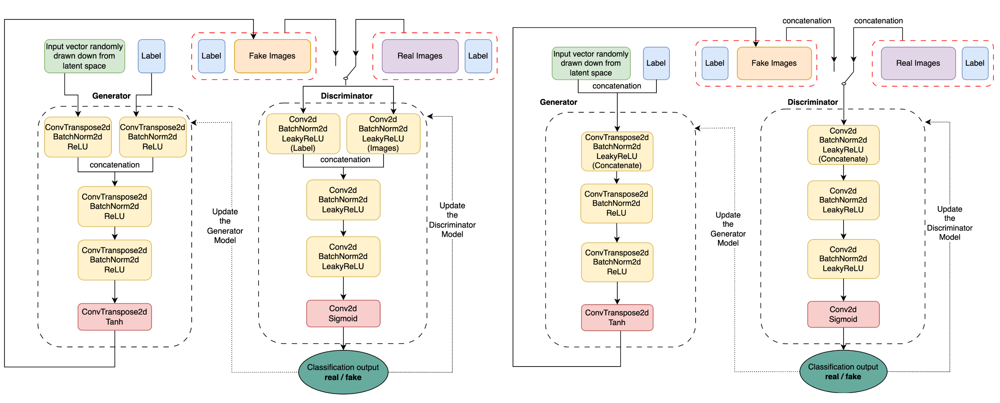
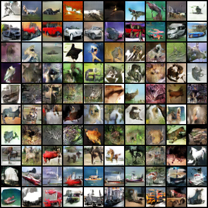
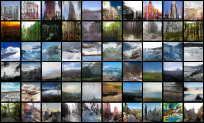
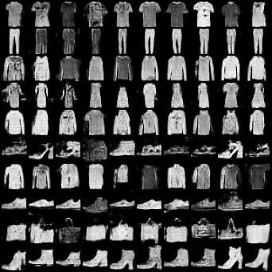
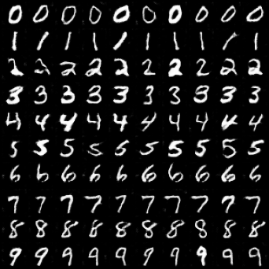

# cGAN-cDCGAN

Implementations of cGANs and cDCGANs. Works on both RBG (CIFAR, Intel) and grayscale (MNIST, Fashion-MNIST) images.

A report could be found [here](doc/report.pdf).

## Description

The ability to generate realistic synthetic images has garnered significant attention in recent years due to its vast potential applications in various domains. 
This report delves into the application of Conditional Deep Convolutional Generative Adversarial Networks (cDCGANs) and Conditional Generative Adversarial Networks (cGANs) in synthetic image generation, a field that has gained significant attention recently. By leveraging the capabilities of generative adversarial networks (GANs) and incorporating conditional inputs, the proposed approach enables the generation of images with specific desired attributes. The project involves training cDCGANs and cGANs on large-scale labeled datasets, where the models are conditioned on auxiliary information such as class labels. This conditioning guides the image generation process, allowing for precise control over the output. To assess the quality of the generated images, traditional image classification models like ResNet-18 and other simple classifiers are employed. These models are trained on the original labeled dataset and subsequently tested on a combination of real and synthetic images. By evaluating the performance of the classifiers on synthetic images, valuable insights regarding the realism and quality of the generated samples can be obtained. Additionally, the project explores the scalability of the proposed approach by evaluating its accuracy on more complex datasets. Through analyzing the models' performance on challenging and intricate datasets, the study provides insights into the potential of cDCGANs and cGANs to generate high-quality images with accurate labels, thereby alleviating the labor-intensive process of manual annotation. In conclusion, this project contributes to advancing synthetic image generation techniques using conditional GANs, while also exploring the potential for automating the labeling process based on similarity measures.


### Architectures

The image below shows the key architectures implemented in this repo.




## Getting Started

### Files
* `dataloader.py`: custom dataloader.
* `get_dataset.sh`: get the Intel Natural Scene dataset for one of the experiments.
* `main.py`: run the entire experiment.
* `metrics.py`: evaluation metrics.
* `models.py`: cGANs and cDCGANs implementations.
* `run.sh`: main file to schedule all of your experiments.
* `train.py`: training methods.
* `utils.py`: helper functions.

### Executing program

Schedule all of your experiments in `run.sh` and run:

```ruby
bash run.sh
```

Note, you may need to edit the path in `get_dataset.sh` if you are runing on the Intel dataset.

Find all of your results in the `results` directory after your experiment(s).


## Example Results


|  |  |
|:---:|:---:|
| CIFAR-10 | Intel Natural Scene |
|  |  |
| Fashion-MNIST | MNIST |

## Authors

* Weiyue Li: wel019@ucsd.edu
* Charles Ye: juy022@ucsd.edu


